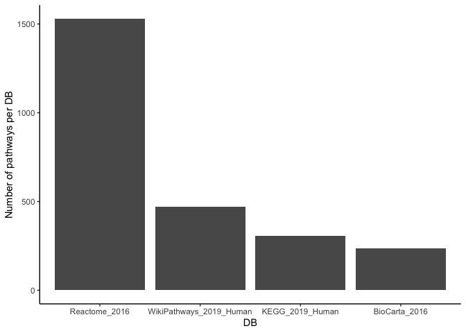
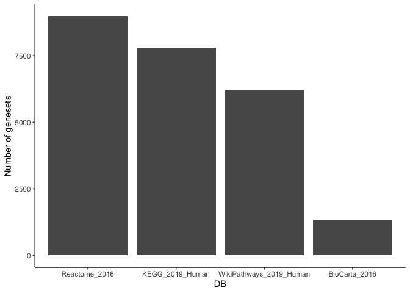
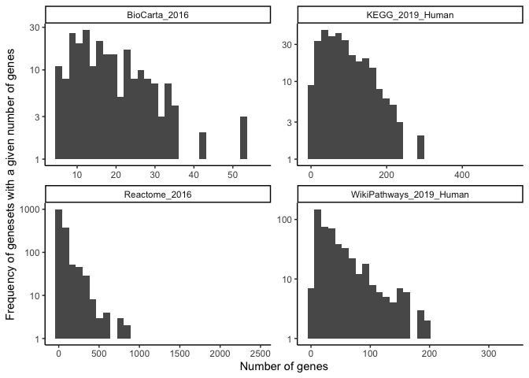

## Steps to reproduce pathwayDB

  - downloaded from <https://amp.pharm.mssm.edu/Enrichr/#stats> on
    February 20, 2020 and converted them to .csv:
      - each row of the file is a pathway name followed by the gene
        symbols that belong to that pathway
      - applying read.delim() on the .txt files resulted in some issues
        (genes names going to the next line down)

<!-- end list -->

``` r
databaseFiles <- c("BioCarta_2016.csv", "KEGG_2019_Human.csv", "Reactome_2016.csv", "WikiPathways_2019_Human.csv")
pathwayDB <- lapply(databaseFiles, function(pathwayName){
  cat("Processing: ", pathwayName, fill = TRUE)
  dat <- read.csv(here::here("inst", "extdata", "pathwayDB", "data", pathwayName), header = FALSE)
  dat[dat == ""] <- NA
  dat %>% 
    gather(Members, Genes, -V1) %>% 
    filter(!is.na(Genes)) %>% 
    rename(Pathways = V1) %>% 
    dplyr::select(Pathways, Genes) %>% 
    mutate(DB = gsub(".csv", "", pathwayName))
}) %>% 
  do.call(rbind, .)
```

    ## Processing:  BioCarta_2016.csv
    ## Processing:  KEGG_2019_Human.csv
    ## Processing:  Reactome_2016.csv
    ## Processing:  WikiPathways_2019_Human.csv

## Pathway DB characteristics

### Which DB has the most genesets?

``` r
pathwayDB %>% 
  dplyr::select(DB, Pathways) %>% 
  group_by(DB) %>% 
  summarise(n = n_distinct(Pathways)) %>% 
  ggplot(aes(x = reorder(DB, -n), y = n)) +
  geom_bar(stat = "identity") +
  ylab("Number of pathways per DB") +
  xlab("DB") +
  theme_classic()
```

<!-- -->

> Reactome has the most genesets whereas BioCarta has the least number
> of genesets.

### Which DB captures the most number of unique genes?

``` r
pathwayDB %>% 
  group_by(DB) %>% 
  summarise(n = n_distinct(Genes)) %>% 
  ggplot(aes(x = reorder(DB, -n), y = n)) +
  geom_bar(stat = "identity") +
  ylab("Number of genesets") +
  xlab("DB") +
  theme_classic()
```

<!-- -->

> BioCarta captures the least number of unique genes, whereas the
> remianing three capture \>5K genes.

### Which pathway is the largest per DB?

``` r
pathwayTally <- pathwayDB %>% 
  group_by(DB, Pathways) %>% 
  summarise(n = n())

pathwayTally %>% 
  ggplot(aes(x = n)) +
  geom_histogram() +
  facet_wrap(vars(DB), scales = "free") + 
  scale_y_log10() +
  ylab("Frequency of genesets with a given number of genes") +
  xlab("Number of genes") +
  theme_classic()
```

<!-- -->

### Genesets with the most number of gene members (n)

| DB                        | Pathways                                               |    n |
| :------------------------ | :----------------------------------------------------- | ---: |
| BioCarta\_2016            | MAPKinase Signaling Pathway Homo sapiens h mapkPathway |   56 |
| KEGG\_2019\_Human         | Pathways in cancer                                     |  530 |
| Reactome\_2016            | Signal Transduction Homo sapiens R-HSA-162582          | 2465 |
| WikiPathways\_2019\_Human | PI3K-Akt Signaling Pathway WP4172                      |  340 |

### Genesets with the least number of gene members (n)

| DB                        | Pathways                                                                    | n |
| :------------------------ | :-------------------------------------------------------------------------- | -: |
| BioCarta\_2016            | Acetylation and Deacetylation of RelA in Nucleus Homo sapiens h RELAPathway | 5 |
| KEGG\_2019\_Human         | Caffeine metabolism                                                         | 5 |
| Reactome\_2016            | Abacavir metabolism Homo sapiens R-HSA-2161541                              | 5 |
| WikiPathways\_2019\_Human | Catalytic cycle of mammalian Flavin-containing MonoOxygenases (FMOs) WP688  | 5 |

## Save package data

``` r
usethis::use_data(pathwayDB, overwrite = TRUE)
```

    ## ✔ Setting active project to '/Users/asingh/Documents/omicsBioAnalytics'
    ## ✔ Saving 'pathwayDB' to 'data/pathwayDB.rda'
